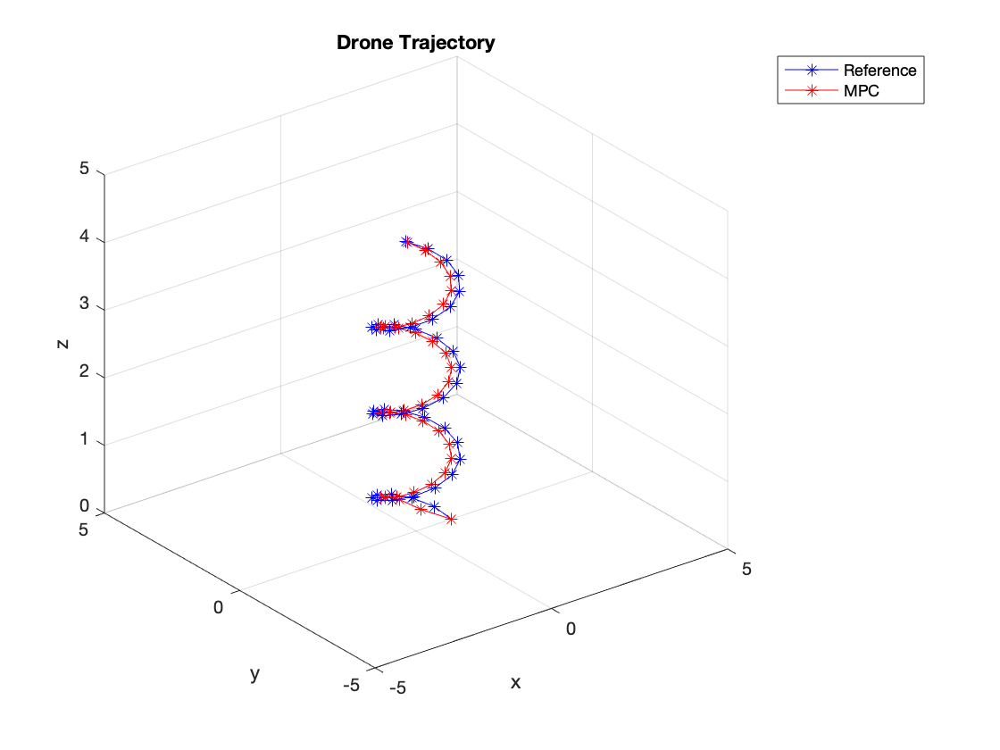

# Linear Model Predictive Control
A generic Linear Model Predictive Control library in MATLAB. 

Compatible backend solvers are quadprog, OSQP and qpOASES. MPC problems can be switched from solver to solver by a single parameter change allowing easy comparisons of solve time and solve quality between different QP solvers.

## Setup Instructions
The default solver in this library is MATLAB Optimization Toolbox's built in quadprog function. To use this, just clone the repo locally and run test_solvers.m.

This library also supports qpOASES and OSQP as backend solvers.

To setup qpOASES, follow the instructions [here](https://github.com/coin-or/qpOASES) (under doc/manual) to setup the MATLAB bindings of qpOASES on your machine. Make sure that the folder qpOASES/interfaces/matlab is added to the MATLAB path.

To setup OSQP, follow the instructions [here](https://osqp.org/docs/get_started/matlab.html) to clone and build OSQP on your machine. You can try using the precompiled binaries but I highly recommend just cloning and building from source. Make sure that the osqp-matlab folder is added to your MATLAB path.

